# NOTE：强化学习

## 事例引入：火星探测车

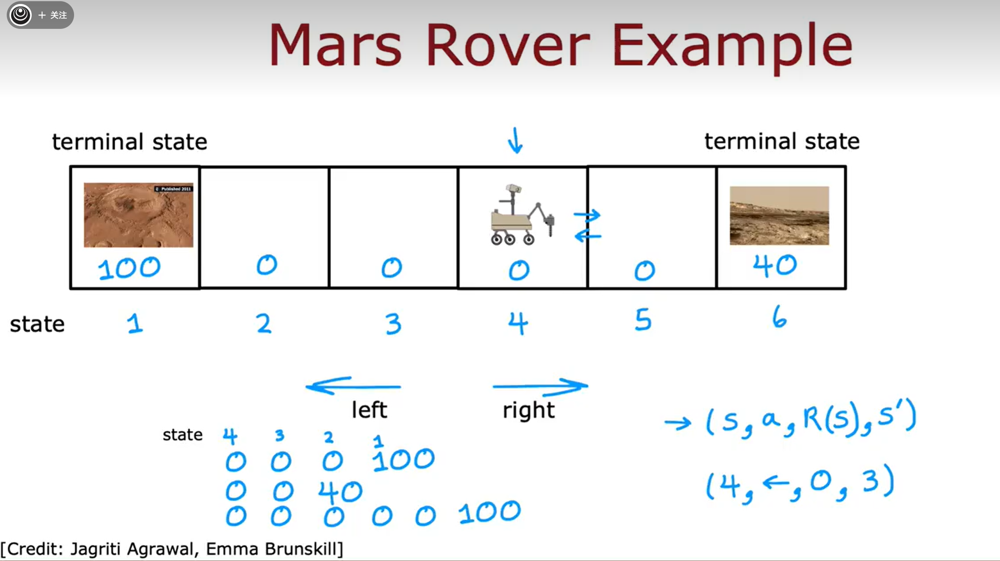

强化学习算法在决定如何采取下一步行动的关键要素：

* state（状态）、action（动作）、R(s) （奖励函数）、state' （下一个状态）

## The return in the reinforcement learning

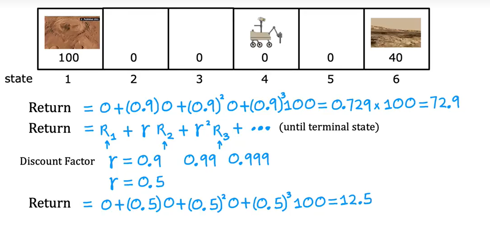

存在折扣因子 $\gamma$ ，使得越早获得奖励使得总回报的价值更高

The return depends on the **actions** you take 

回报是系统获得奖励的总和，经过折扣因子的加权，其中远期奖励的权重是折扣因子提高到更高次幂的结果

## Policies in reinforcement learning

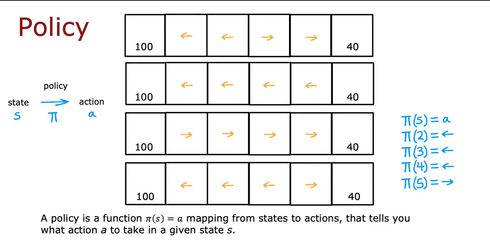

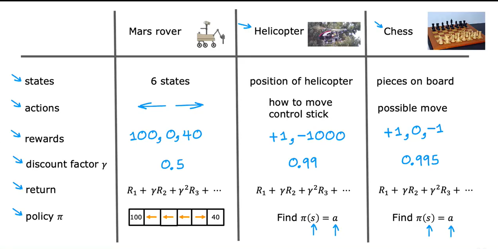

1、马尔科夫决策过程（MDP）

* 未来仅取决于当前状态，而不依赖于达到当前状态之前可能发生的任何情况

  where you are now，not how you get here

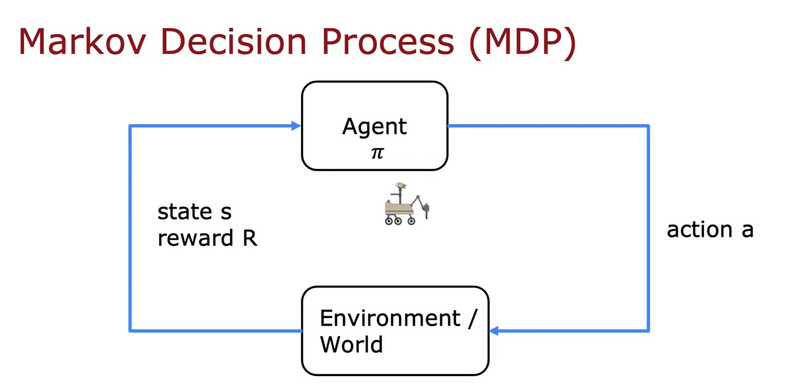

## 状态动作价值函数

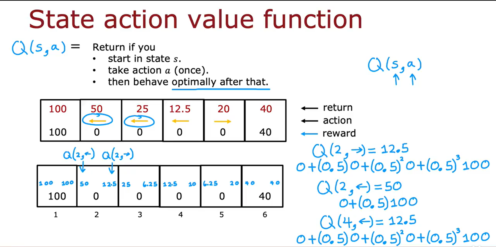

$ Q_{(s,a)}=$ return if you [考虑自己当前的状态]

* start in state s
* take action a(once)
* then behave optimally after that.

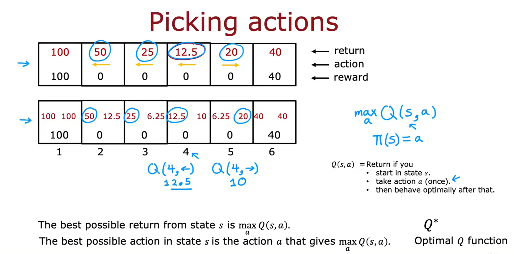

当我处在state s 时，我需要计算在state s下各个动作$a_i$的状态动作价值函数，即$Q_{(s,a)}$，然后比较各个动作的Q函数的大小，取到最大值，即$max Q_{(s,a)}$ ，这样就找到了在state s下的最佳动作 a，得到最佳策略

## 贝尔曼方程

[参量定义]

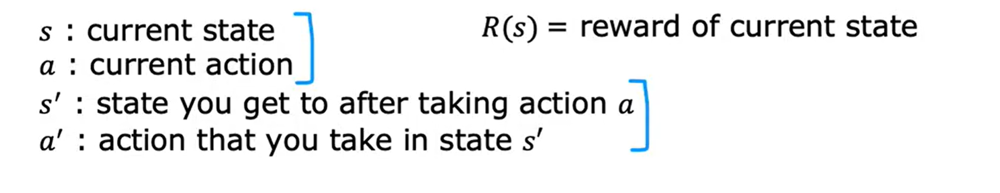

贝尔曼方程：

 $ Q_{(s,a)}=R_{(s)}+\gamma \max_{a'}{Q_{(s',a')}}$

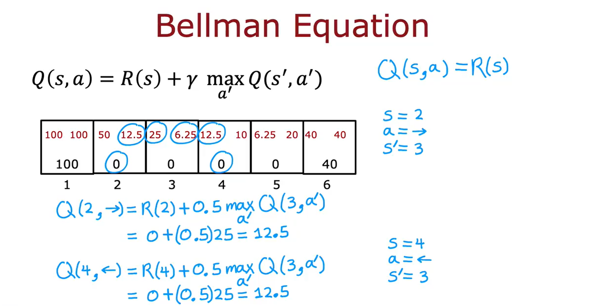

相关解释：

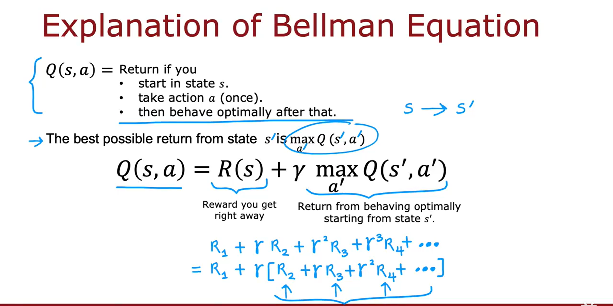

 **当前状态的总回报=及时回报+$\gamma \cdot$下一状态最优策略的回报**

## 随机环境强化学习

* 在执行action a 的时候，有概率执行action b，比如要求向左走，结果最后向右走，即向左走的概率为$p_1$，向右走的概率为$p_2$

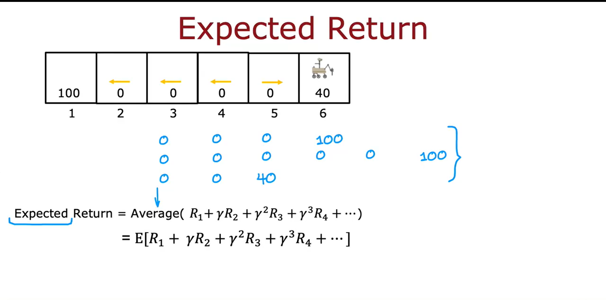

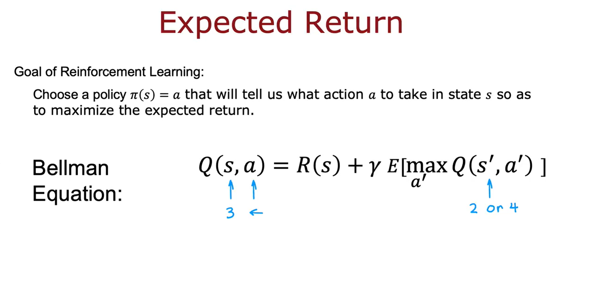

 **goal of reinforcement learning**

注意到在得到预期未来回报时要考虑**期望值** （由s到s'是随机的）

## 连续状态空间运用

被控物体的状态量不是单一的离散之一，而是一个**数字向量** ，其中任何一个数字都可以有大量的可能值

##  月球车着陆

### actions we should define：

* do nothing 
* left thruster
* main thruster
* right thruster

### states we should define:

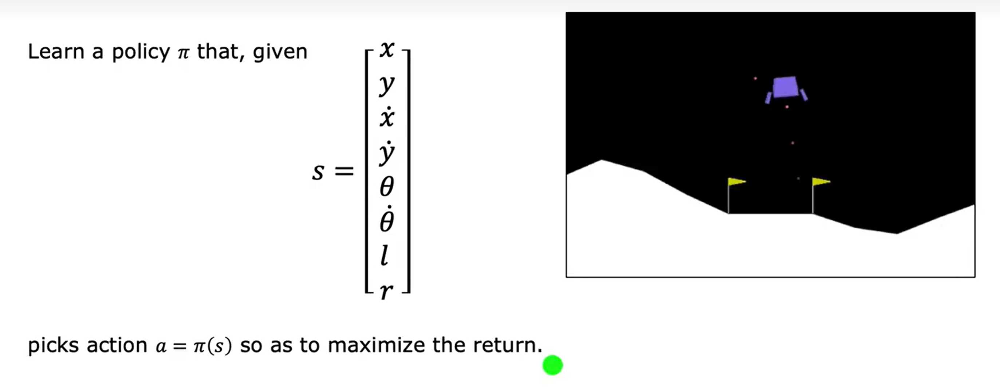

### the reward function:

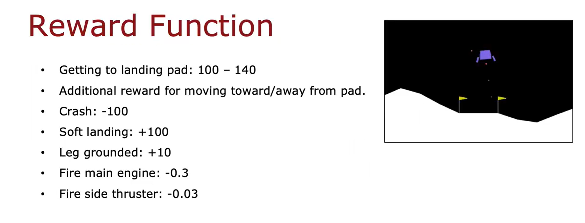

### set the $\gamma$ 

we set the $\gamma$  as 0.985 

## 状态值函数

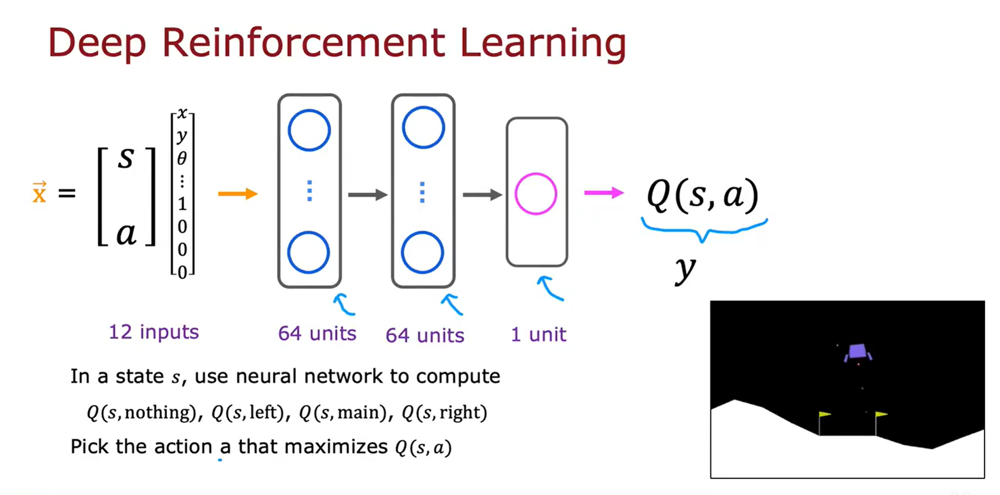

The question we meet : how do you train a neural network to compute 

构建数据集：

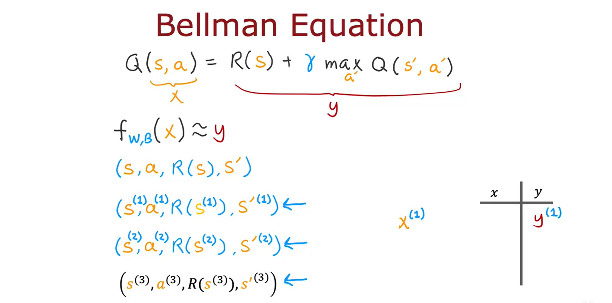

训练实例1：

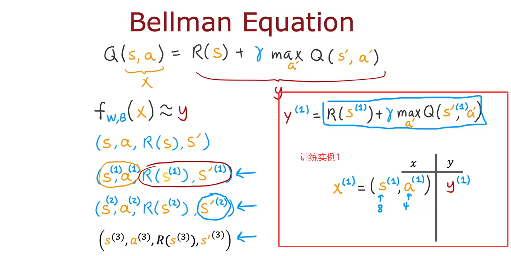

相关解释：

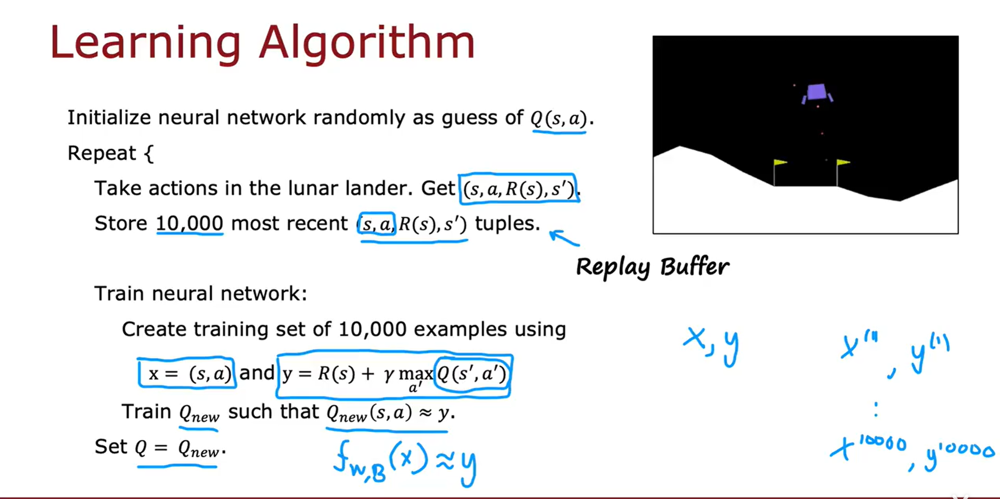

* 先随机初始化神经网络的所有参数
* take actions in the lunar lander，然后得到很多个$(s,a,R_{(s)},s')$这样的元组
* 根据公式$x=(s,a)$and $y=R_{(s)}+\gamma \cdot \max_{a'}{Q_{(s',a')}}$ 得到很多数据对$(x',y')$作为训练神经网络的数据集
* 训练神经网络，得到$Q_{new}$ ,使$Q_{new}(s,a)=y$ [  $f_{w,B}(x) \approx y$  ]
* set the $Q=Q_{new}$ 

## Algorithm refinement ： Improved neutral network architecture

修改神经网络架构：

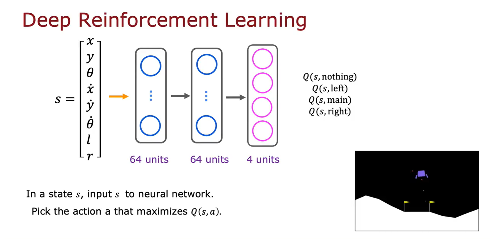

## Algorithm refinement : $\epsilon-greedy$ policy

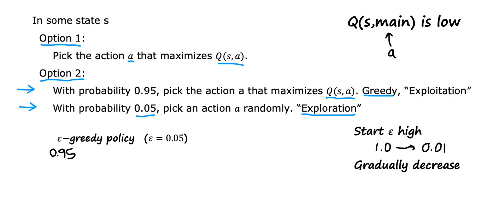

采用$\epsilon-greedy$ policy 可以有效避免由于随机初始化神经网络参数，导致某一种action从来不被考虑执行的情况，在开始阶段可以调大$\epsilon$ 的值，使动作的选择随机化，start $\epsilon$ high and gradually decrease 

## Algorithm refinement ：mini-batch and soft updates

